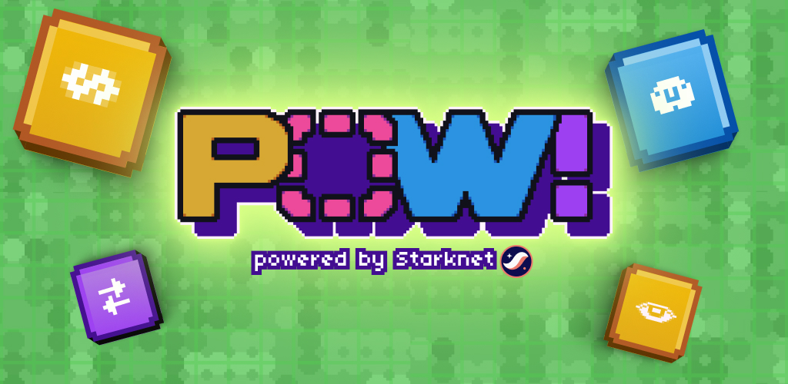

<div align="center">
  

  ***POW!***

<a href="https://www.reactnative.dev/"> 
  
</a>
<a href="https://www.cairo-lang.org/">
  
</a>
<a href="https://www.starknetjs.com/"> 
  
</a>


  [![Exploration_Team](https://img.shields.io/badge/Exploration_Team-29296E.svg?&style=for-the-badge&logo=data:image/svg%2bxml;base64,PD94bWwgdmVyc2lvbj0iMS4wIiBlbmNvZGluZz0iVVRGLTgiPz48c3ZnIGlkPSJhIiB4bWxucz0iaHR0cDovL3d3dy53My5vcmcvMjAwMC9zdmciIHZpZXdCb3g9IjAgMCAxODEgMTgxIj48ZGVmcz48c3R5bGU+LmJ7ZmlsbDojZmZmO308L3N0eWxlPjwvZGVmcz48cGF0aCBjbGFzcz0iYiIgZD0iTTE3Ni43Niw4OC4xOGwtMzYtMzcuNDNjLTEuMzMtMS40OC0zLjQxLTIuMDQtNS4zMS0xLjQybC0xMC42MiwyLjk4LTEyLjk1LDMuNjNoLjc4YzUuMTQtNC41Nyw5LjktOS41NSwxNC4yNS0xNC44OSwxLjY4LTEuNjgsMS44MS0yLjcyLDAtNC4yN0w5Mi40NSwuNzZxLTEuOTQtMS4wNC00LjAxLC4xM2MtMTIuMDQsMTIuNDMtMjMuODMsMjQuNzQtMzYsMzcuNjktMS4yLDEuNDUtMS41LDMuNDQtLjc4LDUuMThsNC4yNywxNi41OGMwLDIuNzIsMS40Miw1LjU3LDIuMDcsOC4yOS00LjczLTUuNjEtOS43NC0xMC45Ny0xNS4wMi0xNi4wNi0xLjY4LTEuODEtMi41OS0xLjgxLTQuNCwwTDQuMzksODguMDVjLTEuNjgsMi4zMy0xLjgxLDIuMzMsMCw0LjUzbDM1Ljg3LDM3LjNjMS4zNiwxLjUzLDMuNSwyLjEsNS40NCwxLjQybDExLjQtMy4xMSwxMi45NS0zLjYzdi45MWMtNS4yOSw0LjE3LTEwLjIyLDguNzYtMTQuNzYsMTMuNzNxLTMuNjMsMi45OC0uNzgsNS4zMWwzMy40MSwzNC44NGMyLjIsMi4yLDIuOTgsMi4yLDUuMTgsMGwzNS40OC0zNy4xN2MxLjU5LTEuMzgsMi4xNi0zLjYsMS40Mi01LjU3LTEuNjgtNi4wOS0zLjI0LTEyLjMtNC43OS0xOC4zOS0uNzQtMi4yNy0xLjIyLTQuNjItMS40Mi02Ljk5LDQuMyw1LjkzLDkuMDcsMTEuNTIsMTQuMjUsMTYuNzEsMS42OCwxLjY4LDIuNzIsMS42OCw0LjQsMGwzNC4zMi0zNS43NHExLjU1LTEuODEsMC00LjAxWm0tNzIuMjYsMTUuMTVjLTMuMTEtLjc4LTYuMDktMS41NS05LjE5LTIuNTktMS43OC0uMzQtMy42MSwuMy00Ljc5LDEuNjhsLTEyLjk1LDEzLjg2Yy0uNzYsLjg1LTEuNDUsMS43Ni0yLjA3LDIuNzJoLS42NWMxLjMtNS4zMSwyLjcyLTEwLjYyLDQuMDEtMTUuOGwxLjY4LTYuNzNjLjg0LTIuMTgsLjE1LTQuNjUtMS42OC02LjA5bC0xMi45NS0xNC4xMmMtLjY0LS40NS0xLjE0LTEuMDgtMS40Mi0xLjgxbDE5LjA0LDUuMTgsMi41OSwuNzhjMi4wNCwuNzYsNC4zMywuMTQsNS43LTEuNTVsMTIuOTUtMTQuMzhzLjc4LTEuMDQsMS42OC0xLjE3Yy0xLjgxLDYuNi0yLjk4LDE0LjEyLTUuNDQsMjAuNDYtMS4wOCwyLjk2LS4wOCw2LjI4LDIuNDYsOC4xNiw0LjI3LDQuMTQsOC4yOSw4LjU1LDEyLjk1LDEyLjk1LDAsMCwxLjMsLjkxLDEuNDIsMi4wN2wtMTMuMzQtMy42M1oiLz48L3N2Zz4=)](https://github.com/keep-starknet-strange)

</div>


POW! is an on-chain mobile clicker game built with React Native and powered by Starknet. In POW!, you step into the role of a blockchain operator, submitting transactions by tapping and mining blocks to earn points. Progress is stored directly on-chain, enabling a fully decentralized experience. Upgrade your blockchain, automate your setup, and unlock achievements through the in-game shop as you build the most powerful chain.

## Features
- **Mobile-First Design** – Built with React Native and Expo for cross-platform support
- **On-Chain Progression** – Game state is stored on Starknet for decentralized persistence.
- **Upgradeable Smart Contracts** – Use Cairo contracts for game logic.
- **Embedded Wallet** – Embedded smart-contract account using AVNU Paymasters


## Tech Stack

- **Framework:** React Native with Expo
- **Language:** TypeScript and Cairo
- **Wallet Integration:** OpenZeppelin Smart Account
- **Blockchain Interaction:** Starknet.js

## Getting Started

### Prerequisites

Ensure you have the following installed:

- **npm**
- **Expo CLI**
- **Scarb**

### Setup

Clone the repository:

```sh
git clone https://github.com/keep-starknet-strange/click-chain.git
cd click-chain
```

Install dependencies:

```sh
cd frontend
npm install
```

Start the frontend:

```sh
cd frontend
npx expo start
```

Linter

```sh
cd frontend
npx eslint
```


### Setting up Scarb
 - [Install Scarb](https://docs.swmansion.com/scarb/download)

 - [Install Starknet Foundry](https://github.com/foundry-rs/starknet-foundry)

 Using `asdf`, `scarb 2.11.1` and `starknet-foundry 0.38.3`  will be set for you

## Usage

1. Open the app on your mobile device
2. Create an account or login with your username
3. Start by sending transactions to build your first block and earn miner points
5. Spend your points on upgrades to increase your setup's speed and yield
6. Track your on-chain leaderboard ranking

## Roadmap

- [ ] coming soon...

## Contributors ✨

Thanks goes to these wonderful people ([emoji key](https://allcontributors.org/docs/en/emoji-key)):

<!-- ALL-CONTRIBUTORS-LIST:START - Do not remove or modify this section -->
<!-- prettier-ignore-start -->
<!-- markdownlint-disable -->
<table>
  <tbody>
    <tr>
      <td align="center" valign="top" width="14.28%"><a href="https://github.com/b-j-roberts"><br /><sub><b>Brandon R</b></sub></a><br /><a href="https://github.com/keep-starknet-strange/raito/commits?author=b-j-roberts" title="Code">💻</a></td>
      <td align="center" valign="top" width="14.28%"><a href="https://github.com/ZackAttax"><br /><sub><b>ZackAttax</b></sub></a><br /><a href="https://github.com/ZackAttax" title="Code">💻</a></td>
      <td align="center" valign="top" width="14.28%"><a href="https://github.com/0xsisyfos"><br /><sub><b>0xsisyfos</b></sub></a><br /><a href="https://github.com/0xsisyfos" title="Code">💻</a></td>
    </tr>
  </tbody>
  <tfoot>
    <tr>
      <td align="center" size="13px" colspan="7">
        
          <a href="https://all-contributors.js.org/docs/en/bot/usage">Add your contributions</a>
        </img>
      </td>
    </tr>
  </tfoot>
</table>


<!-- markdownlint-restore -->
<!-- prettier-ignore-end -->

<!-- ALL-CONTRIBUTORS-LIST:END -->

This project follows the [all-contributors](https://github.com/all-contributors/all-contributors) specification. Contributions of any kind welcome!

## License

MIT License © 2025 Click chain Team
